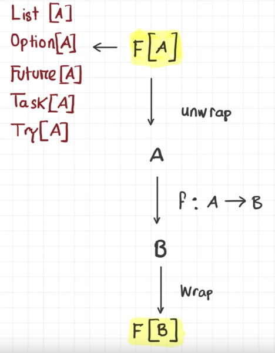

## Functional Programming (Talk by Adil Akhter)

* Functions should be most preferred implementation
* Function = Total Function (Maths)
	* mapping of elements from Type A to Type B, such that for every element in A has exactly one mapping in set B

```java
@ case class Coordinate(lng: Double, lat: Double)

@ def readCoordinate(): Coordinate = {
	println("Longitue: ")
	val lng = StdIn.readLine().toDouble
	println("Latitude: ")
	val lat = StdIn.readLine().toDouble
	Coordinate(lng, lat)
}
```

> readCoordinate: Unit => Coordinate

* Is `readCoordinate()` a function as per defintion?
	* It's not as we are throwing side-effects
	* If `string` read from input is not a valid `double` then we get an exception thrown
	* Why is this bad?
		* Following the type-signature there's no way of knowing that this might throw an exception
		* Breaks the law of `referential transparency` of FP paradigm

### Functor

* Suppose you have have value of type `A` within a container and you would like to apply function `f: A => B` on the value
	* You would have to do the following in-order to do so


		
> Functor: Algebrai type that applies a function to every element of a structure
```scala
trait Functor[F[_]] {
	def map[A,B](f: A => B): F[A] => F[B]
}
```
> For `F` to be a functor, needs to implement `map` operation

* Also needs to satisfy certain laws:
	* IDENTITY `map(fa)(identity) = fa`

		```scala
		@ List(1,2).map(identity)
		res14: List[Int] = List(1,2)
		```

	* COMPOSITION `fa.map(ab).map(bc) = fa.map(ab.andThen(bc))`

```scala
sealed trait Tree[A]
case class Leaf[A](a: A) extends Tree[A]
case class Node[A](left: Tree[A], right: Tree[A]) extends Tree[A]
```

```scala
implicit val treeFunctor = new Functor[Tree] {
	def map[A, B](fa: Tree[A])(f: (A) => B): Tree[B] =
		fa match {
			case Leaf(a: A) => Leaf(f(a))
			case Node(left, right) => Node(map(left)(f), map(right)(f))
		}
}
```

```scala
@ val tree = Node(Leaf("ma;am"), Leaf("ßß"))
@ val transformedTree: Tree[String] = Functor[Tree].map(tree)(f)
@ transformedTree shouldEqual Node(Leaf("ma-am"), Leaf("ssss"))
```

* `Functor` only allows one argument to be mapped
* If we want multiple arguments, then we use `Applicative`

### Applicative

* Allows a function with multiple arguments to be mapped

> `F[A] => F[A => B] => F[B]`

* In order to be __applicative__, functor must satisfy the following:

```scala
trait Applicative[F[_]] extends Functor[F] {
	def apply[A, B](f: F[A => B]): F[A] => F[B]
	def pure[A](a: => A): F[A]
}
```

* `pure` converts type `A` to a __functor__ (Also, called __lifting__)